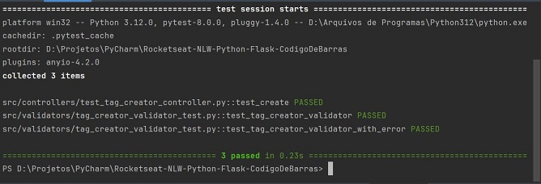

# Rocketseat - NLW - Python - Flask - Código De Barras

Projeto do evento NLW da Rocketseat usando Python e Flask para gerar código de barras.


## Passos
1. Criar projeto Flask no PyCharm:


2. Instalar outras dependências:
- pillow
- python-barcode
- Cerberus
- pytest

3. Alterar `app.py`:
- remover rota `/`;
- adicionar rota `POST '/create_tag'` que recebe "product_code" e cria uma imagem na pasta do programa;

4. Testar rota `http://127.0.0.1:5000/create_tag` com Postman passando ```{"tag path": "987-654-321"}```;


5. Criar diretórios:
- a partir da raiz do projeto: `/src`, `/src/controllers`, `/src/drivers`, `/src/errors`, `/src/main`, 
  `/src/main/routes`, `/src/main/server`,`/src/validators`, `/src/views`, `/src/views/http_types`
- todos devem ter um arquivo `__init__.py`


6. Extrair parte do código de `app.py` para 
- `server.py`: cria app e registra Blueprints
- `tag_routes.py`: cria um Blueprint para a rota `POST '/create_tag'`

7. Extrair parte do código da função `create_tag` de `tag_routes.py` para os arquivos:
- `src/drivers/barcode_handler.py` com a classe BarcodeHandler;
- `src/views/tag_creator_view.py` com a classe TagCreatorView;
- `src/controllers/tag_creator_controller.py` com a classe TagCreatorController;
- `src/views/http_types/http_request.py` com a classe HttpRequest;
- `src/views/http_types/http_response.py` com a classe HttpResponse.

8. Criar uma função para exibir erro após tratá-lo com `try except`:
- `src/errors/error_handler.py` com função `handle_errors`;
- função `create_tag` trata exceptions com `try except`.

9. Adicionar error personalizado e validação:
- `src/errors/error_types/http_unprocessable_entity.py` com a classe `HttpUnprocessableEntityError`;
- `src/validators/tag_creator_validator.py` com a função `tag_creator_validator`.

10. Criar testes:
- os nomes dos arquivos de testes devem terminar com `_test.py`;
- `pytest -s -v` para executar todos os testes do diretório.




## Certificado


