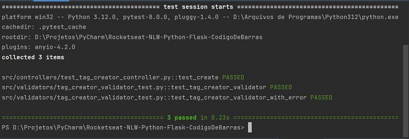
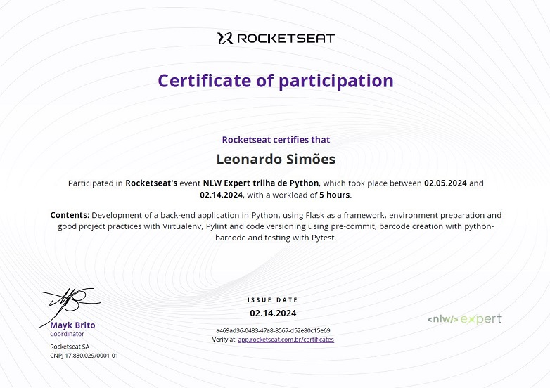

# Rocketseat - NLW - Python - Flask - Barcode

Rocketseat's NLW event project using Python and Flask to generate barcode.


## Steps
1. Create Flask project in PyCharm:


2. Install other dependencies:
- pillow
- python-barcode
- Cerberus
- pytest

3. Change `app.py`:
- remove route `/`;
- add route `POST '/create_tag'` which receives "product_code" and creates an image in the program folder;

4. Test route `http://127.0.0.1:5000/create_tag` with Postman passing ```{"tag path": "987-654-321"}```;


5. Create directories:
- from the project root: `/src`, `/src/controllers`, `/src/drivers`, `/src/errors`, `/src/main`,
   `/src/main/routes`, `/src/main/server`, `/src/validators`, `/src/views`, `/src/views/http_types`
- everyone must have a `__init__.py` file


6. Extract part of the code from `app.py` to
- `server.py`: creates app and registers Blueprints
- `tag_routes.py`: creates a Blueprint for the `POST '/create_tag'` route

7. Extract part of the `create_tag` function code from `tag_routes.py` to the files:
- `src/drivers/barcode_handler.py` with the BarcodeHandler class;
- `src/views/tag_creator_view.py` with the TagCreatorView class;
- `src/controllers/tag_creator_controller.py` with the TagCreatorController class;
- `src/views/http_types/http_request.py` with the HttpRequest class;
- `src/views/http_types/http_response.py` with the HttpResponse class.

8. Create a function to display an error after handling it with `try except`:
- `src/errors/error_handler.py` with `handle_errors` function;
- function `create_tag` handles exceptions with `try except`.

9. Add custom error and validation:
- `src/errors/error_types/http_unprocessable_entity.py` with class `HttpUnprocessableEntityError`;
- `src/validators/tag_creator_validator.py` with the `tag_creator_validator` function.

10. Create tests:
- test file names must end with `_test.py`;
- `pytest -s -v` to run all tests in the directory.




## Certificate


